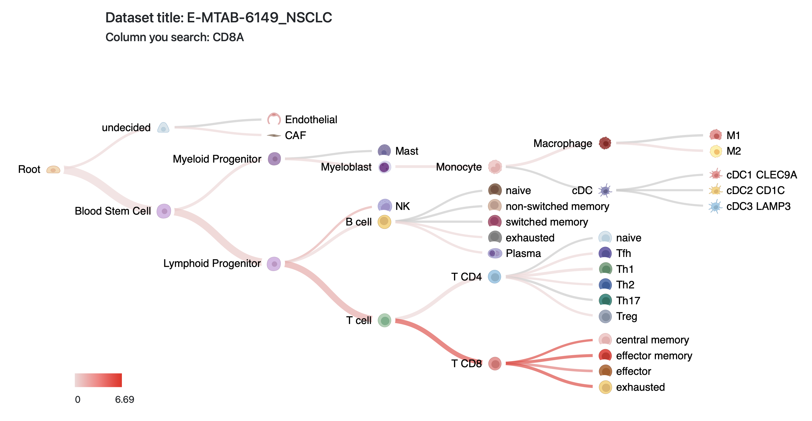
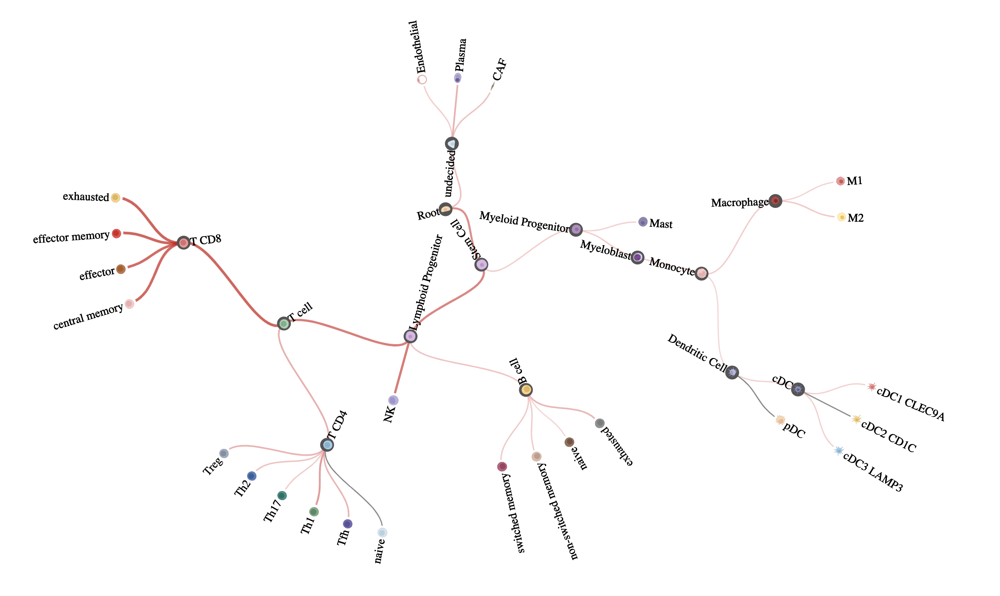

## Lineage Visualization

#### We provide a web interface(http://lineagetree.cbcb.umd.edu) that enables researchers to query gene expression values in our pre-processed data at Tres (https://resilience.ccr.cancer.gov).  

Users could easily visualize expression data in a hieracrhical way. The gene expression levels across different cell types are mapped on to a knowledge-based cell lineage structure. 
The hierarchical tree strcuture facilitates the exploration and interpretation of the data.

#### For developers, this is a highly customizable javascript library, which could be easily tailored to different structures or purposes.


**Tree layout**
---
There are two different layouts available, and both are collapsible :
1. Horizontal tree. 
2. Radial tree.

We apply color scale to edges based on the expression level and the width of edge are proportional to it as well.

Preview:
* Horizontal tree

    

* Radial tree

    


**How to use**
---
Check the example html file we provide under the [tree_example](https://github.com/data2intelligence/lineage_visualization/tree/main/tree_example) folder.

In brief, you could load the JavaScript file as a library, along with other libraries(e.g. d3 library). We wrapped up the visulization function to **two master functions** for horizontal and radial trees. Both of them have four arguments: 
* input_data: path to input data (gene expression level and child-parent relationship).
* search_gene: name of the gene(feature) you would like to search.
* location1: where you would like to append the diagram to.
* path_to_icon_folder: path to the icon image folder.

Then you could pass these arguments and call the master function(s) to generate a hierarchical tree.

Please see detailed information below.

**How to prepare your input data**
---
For general purpose, your input data would be a **.csv** file which contains three parts: child-parent relationship, values for features you want to display, and the size of each child node.

In the **.csv** file, the first two column "parent" and "id" are used to represent the child-parent relationship. Each child node, except the root, should a parent node. The root should have no value for their "parent" column. The "id" is reuiqred to be unique, whereas you could use duplicated "label"s for nodes when labeling the node in the diagram. The "size" column is used to calculate the weighted average if each node have different number of data points. For other columns, you could store values for any features that you are going to visualize in the tree structure.

We will use scRNA sequencing data as an example to show that how to format the input data:


1. Raw data should include:
    * meta data: annotate the cell type for each cell and specify the cell lineage relationship. This will determine the tree strcuture.
    * gene expression matrix: the gene expression value for each cell. This will be the value(color-scaled) in the diagram.
    

2. Integrate your gene expression data with meta data.

    |parent|id|leaf_node|label|CD8A|celltype_size|
    |------|--|---------|-----|----|-------------|
    ||T cell|non_leaf|T cell|||
    |T cell|T CD4|non_leaf|T CD4|||
    |T cell|T CD8|non_leaf|T CD8|||
    |T CD4|T CD4 naive|leaf_node|naive|0.0|39.0|
    |T CD4|Th1|leaf_node|Th1|3.09|3048|
    |T CD8|T CD8 central memory|leaf_node|central memory|6.19|980.0|
    |T CD8|T CD8 effector|leaf_node|effector|5.98|2130.0|

Prepare your data as a **.csv** file.
```
parent,id,label,CD8A,celltype_size
,T cell,non_leaf,T cell,,,
T cell,T CD4,non_leaf,T CD4,,,
T cell,T CD8,non_leaf,T CD8,,,
T CD4,T CD4 naive,leaf_node,naive,0.0,39.0
T CD4,Th1,leaf_node,Th1,3.09,3048.0
T CD8,T CD8 central memory,leaf_node,central memory,6.19,980.0
T CD8,T CD8 effector,leaf_node,effector,5.98,2130.0
```
1.  The "parent" and "id" are two columns that represent the relationship of parent-child pairs, which are required to generate the hierarchical tree.
    * As shown in the first row, "T cell" is the root node which does not have a "parent". The structure should have and only have one root node.
    * The "id" should be a unique id for each celltype.
    * Unique id is also used to match the path to icon image for each node.
2.  The "label" is the text displayed on the webpage, allowing for duplicates.
3. Next column(s) should be gene expression level. Here we use "CD8A" gene as an example. You could have as many columns as you want here.
4. The last column is the number of cells in certain cell type.
    * Expression values and size of celltype are required for leaf nodes, while we provide a recursive function to calculate the weighted average expression level for root node and all internal nodes.

**Download and edit the image**
---
For both layouts, we provide a download button to download the svg image. You will open `open` -> `open with Google Chrome` (Or any other browser you are using) to view the image. Since we use the online source for the cell type icons, we need the browser to render the complete image. Then `right click` -> `print`, you could download the svg in `pdf`, which enables you to edit the diagram in editor software, like InkScape. You could drag the icons, modify the text.

P.S. If you use icons from a local folder, you could move the svg to the folder according to the path you used in your JS script. 