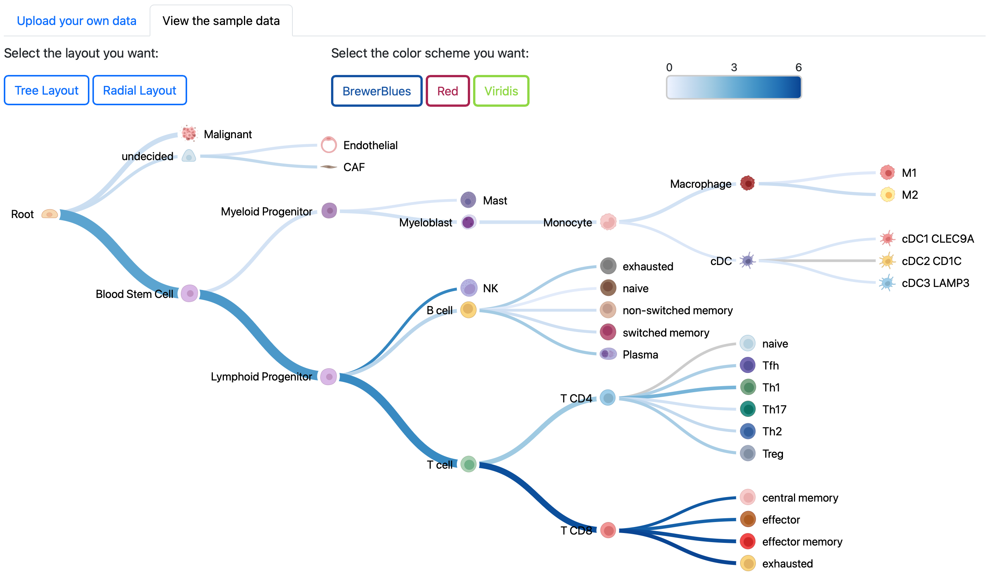
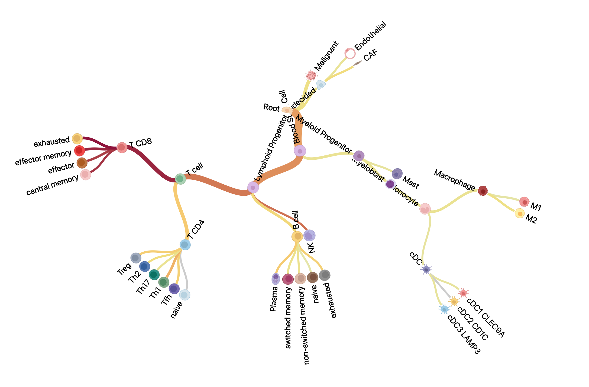

## Lineage Visualization

#### We provide a web interface(https://collapsibletree.cbcb.umd.edu) that enables researchers to query gene expression values in our pre-processed data at tumor-resilient T cell (Tres) model (https://resilience.ccr.cancer.gov).  

Users can easily visualize expression data hierarchically. Gene expression levels across different cell types are mapped onto a knowledge-based cell lineage structure. The hierarchical tree structure facilitates the exploration and interpretation of the data.

#### For developers, this is a highly customizable JavaScript library that can be easily tailored to different structures or purposes.

**Tree layout, color theme and interactive functions**
---
#### **Two Layouts**
The layouts are switchable by buttons. In both layouts, the nodes are collapsible when you click them:
1. Horizontal tree. 
2. Radial tree.

#### **three Color Themes**
The color scale is applied to the edges based on the expression level, and the specific expression value will be displayed when you mouse over the edge. The width of the edges is proportional to the number of cells in certain cell typs. 

Preview:
* Horizontal tree
    

* Radial tree
    


**How to use**
---
1- Run the sample webapp*

We demonstrate a basic example of 'collapsible tree'. In this example, we run the app on a local server using Django.

To run this example, use the following command:
```bash
bash run_server.sh
```
This script will help you to:
- 1. Create a conda environment based on the provided `environment.yaml` file.
- 2. Start the Django server.

The server will be running at http://127.0.0.1:8000.

2- Customizing the Collapsible Tree
For customization, including integrating the collapsible tree into an existing web application or modifying it for your needs:

- The JavaScript file, CSS file and sample input data, icon folder are availabel in the `static` folder. 
- The HTML file can be found under `templates/main`.

To use the collapsible tree function, load the JavaScript file along with the required libraries (e.g., D3 library, jquery etc). he visualization functionality is encapsulated in a **master functions** for both horizontal and radial trees. It accepts the following four arguments:

* **input_data**: Path to the input data (data and child-parent relationships).
* **search_column**: The name of the gene (or feature) you want to visualize.
* **svg_location_id**: The container ID, specifying where the diagram should be appended.
* **path_to_icon_folder**: Path to the folder containing the icon images.

3- Other customization options:
* Customize your own color theme: Modify the variable _schemes_ in the tree_visualization.js file to create your own color style.

Please see detailed information for data preparation below.

**How to prepare your input data**
---
For general purpose, your input data would be a **.csv** file which contains three parts: child-parent relationship, values for features you want to display, and the size of each child node.

In the **.csv** file, the first two column "parent" and "id" are used to represent the child-parent relationship. Each child node, except the root, should a parent node. The root should have no value for their "parent" column. The "id" is reuiqred to be unique, whereas you could use duplicated "label"s for nodes when labeling the node in the diagram. The "size" column is used to calculate the weighted average if each node have different number of data points. For other columns, you could store values for any features that you are going to visualize in the tree structure.

We will use scRNA sequencing data as an example to show that how to format the input data:


1. Raw data should include:
    * meta data: annotate the cell type for each cell and specify the cell lineage relationship. This will determine the tree strcuture.
    * gene expression matrix: the gene expression value for each cell. This will be the value(color-scaled) in the diagram.
    

2. Integrate your gene expression data with meta data.

    |parent|id|label|celltype_size|CD8A|
    |------|--|-----|----|-------------|
    ||T cell(Root)|T cell|||
    |T cell|T CD4|T CD4|||
    |T cell|T CD8|T CD8|||
    |T CD4|T CD4 naive|naive|39.0|0.0|
    |T CD4|Th1|Th1|3048|3.09|
    |T CD8|T CD8 central memory|central memory|980.0|6.19|
    |T CD8|T CD8 effector|effector|2130.0|5.98|

Prepare your data as a **.csv** file.
```
parent,id,label,CD8A,celltype_size
,T cell,T cell,,,
T cell,T CD4,T CD4,,,
T cell,T CD8,T CD8,,,
T CD4,T CD4 naive,naive,0.0,39.0
T CD4,Th1,Th1,3.09,3048.0
T CD8,T CD8 central memory,central memory,6.19,980.0
T CD8,T CD8 effector,effector,5.98,2130.0
```
1.  The "parent" and "id" are two columns that represent the relationship of child-parent pairs, which are required to generate the hierarchical tree.
    * As shown in the first row, "T cell" is the root node which does not have a "parent". The structure should have and only have one root node.
    * The "id" should be a unique id for each celltype.
    * Unique id is also used to match the path to icon image for each node.
2.  The "label" is the text displayed on the webpage, allowing for duplicates.
3. Next column(s) should be gene expression level. Here we use "CD8A" gene as an example. You could have as many columns as you want here, but "CD8A" is the only column will be displayed.
4. The last column is the number of cells in certain cell type.
    * Expression values and size of celltype are **required** for leaf nodes(i.e. node with no children node), the leaf nodes are required to have value, O is also a valid value. While for root node and all internal nodes, it is acceptable if they possess null value. If they don't have an initial value, we provide a recursive function to calculate the weighted average expression level; if they do have a initial value, the function will keep the original value.

**Download and edit the image**
---
For both layouts, we provide a download button to download the svg image. You will open `open` -> `open with Google Chrome` (Or any other browser you are using) to view the image. Since we use the online source for the cell type icons, we need the browser to render the complete image. Then `right click` -> `print`, you could download the svg in `pdf`, which enables you to edit the diagram in editor software, like InkScape. You could drag the icons, modify the text.

P.S. If you use icons from a local folder, you could move the svg to the folder according to the path you used in your JS script. 